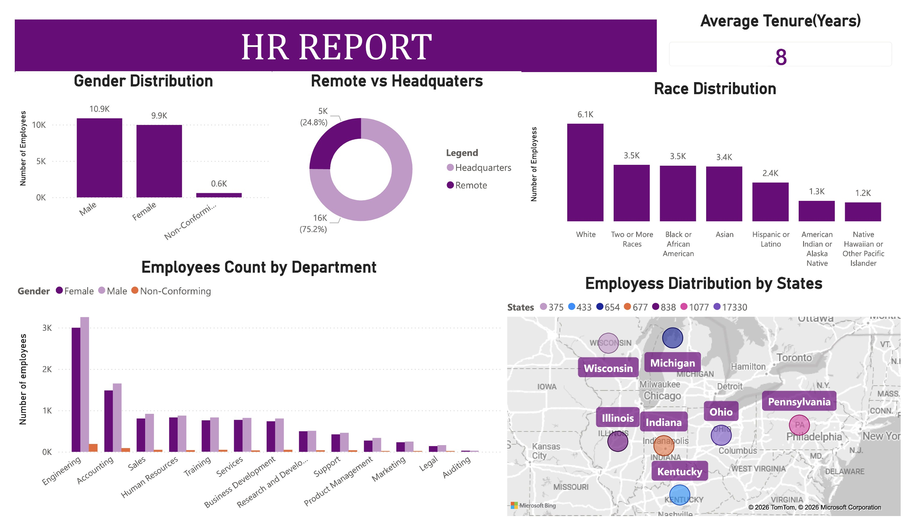
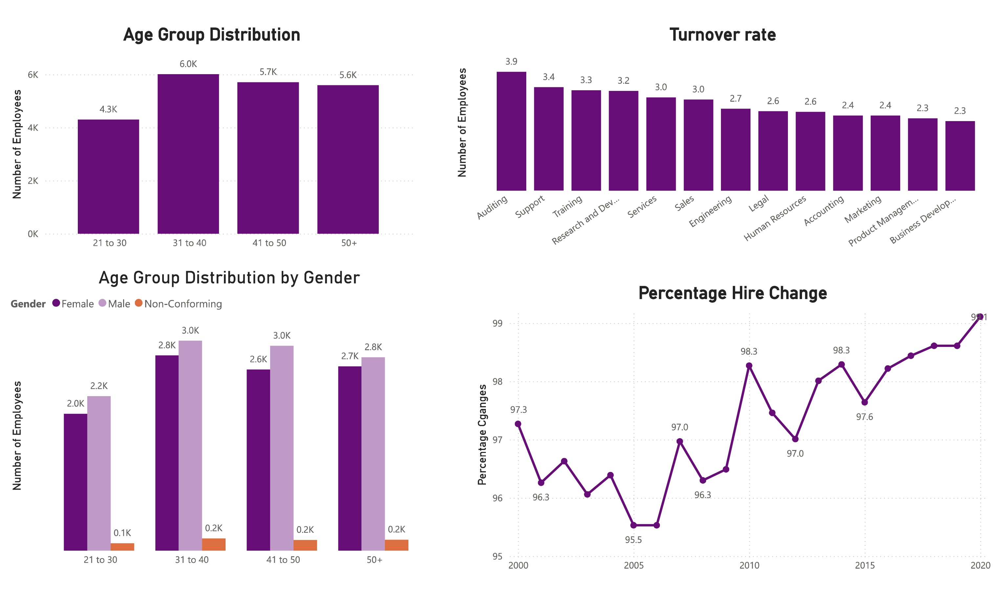

# HR-workforce-
HR Workforce Project
# HR Workforce Analytics Dashboard

## 📌 Project Overview
This project is a deep-dive analysis of a workforce dataset containing over **18,000 employee records**. Using my background in **Mathematics and Statistics**, I transformed raw CSV data into a strategic dashboard to help leadership understand hiring trends, diversity, and departmental growth.

## 🛠️ Data Stack
- **Data Source:** HR Data (21k+ records)
- **Cleaning:** Microsoft Excel
- **Analysis:** SQL & Python
- **Visualization:** Power BI

## 📊 Key Dashboards & Insights
*(Note: Screenshots are taken from the final Power BI report)*

https://github.com/keshasoni29-sys/HR-workforce-/blob/main/HR%20Workforce%20Analytics%20Dashboard%20Final.pptx

### 1. Workforce Overview
- **Total Staff:** 18.3K
- **Average Tenure:** 7.0 Years
- **Primary Hub:** Ohio (HQ)

### 2. Departmental Distribution
The data reveals that **Engineering** is the largest vertical with over 6,300 employees, followed by **Services** and **Sales**. This highlights a product-heavy organizational structure.

### 3. Diversity & Demographics
- **Gender Balance:** A healthy split of 51% Male and 46% Female.
- **Racial Profile:** White (5.2K) and Asian (3.0K) represent the largest groups, with a clear opportunity to expand Hispanic and Native American recruitment.

## 💡 Strategic Recommendations
- **Retention:** With 7 years being the average tenure, I recommend a "Stay Interview" program for employees in their 5th year to prevent attrition.
- **Scaling:** Based on the hiring trajectory, recruitment should focus on the Remote model to tap into global talent.

## 🎓 The Mathematical Edge
As a Master of Mathematics, I applied **inferential statistics** to ensure that the growth trends observed in the data were statistically significant and not just seasonal fluctuations.

---
**Prepared by:** Kesha Soni
[LinkedIn](www.linkedin.com/in/kesha-soni-a75aa4239) | [Portfolio](YOUR_PORTFOLIO_LINK_HERE)
